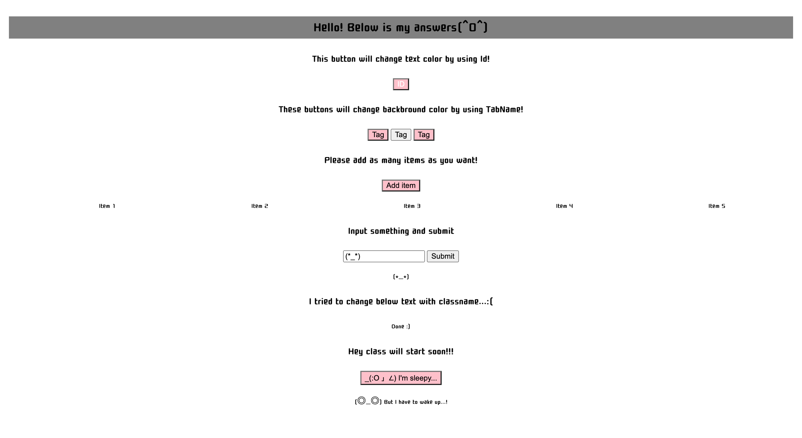

###### Easy:

Q: How do you select an element with the id "my-element" using JavaScript?

A: Using document.getElementById() method.
   Answer is `document.getElementById('my-element')`.
***

Q: Create a button in HTML and use JavaScript to change its text when it is clicked.
```html
<button id="myButton">Click me</button>
<script>
  let btn = document.getElementById('myButton');
  btn.addEventListener('click', () => {
      btn.style.color = 'blue';
  });
</script>
```
When I select more than one element(= object HTMLCollection), use for loop.
```html
<button>first</button>
<button>second</button>
<script>
    let btns = document.getElementsByTagName('button');
    for(let i = 0; btns.length; i++) {
        btns[i].addEventListener('click', (e) => {
        e.target.style.color = 'red';
        });
    };
</script>
```
***

Q: Create a list of items in HTML and use JavaScript to add a new item to the list when a button is clicked.
```html
<ul id="myList">
  <li>Item 1</li>
  <li>Item 2</li>
  <li>Item 3</li>
</ul>
<button id="addButton">Add item</button>

<script>
  let myList = document.getElementById('myList');
  let addBtn = document.getElementById('addButton');

  addBtn.addEventListener('click', () => {
      let listnumber = myList.childElementCount;
      let item = document.createElement('li');
      item.innerHTML = `Item ${listnumber + 1}`;
      myList.appendChild(item);
  })
</script>
```
***

Q: Create a form in HTML with a text input and a submit button. Use JavaScript to display the value of the text input when the form is submitted.
```html
<form id="myForm">
  <input type="text" id="myInput">
  <input type="submit" value="Submit">
</form>
<p id="myOutput"></p>

<script>
  let submitBtn = document.getElementById('myForm');
  let myInput = document.getElementById('myInput');
  let myOutput = document.getElementById('myOutput');

  submitBtn.addEventListener('click', (e) => {
    e.preventDefault();
    myOutput.innerHTML = `${myInput.value}`;
  });
</script>
```
***

###### Medium:

Q: How do you change the text of an element with the class "my-class" using JavaScript?

A: using `document.getElementsByClassName` method then `innerHTML` with specifying index of the element.
```js
let myClass = document.getElementsByClassName('my-class');
myClass[0].innerHTML = 'Done :)';
```
***

###### Hard:

Q: How do you add a new element to the DOM and then remove it after 3 seconds using JavaScript?

A: First, I created a way to add new elements with `innerHTMl` and `appendChild`.

Then I set the remove function with `removeChild`.

 Finally I put these inside `addEventLister` that fires by click.
```html
<button id="flashButton">_(:O 」∠) I'm sleepy...</button>
<div id="flashList"></div>
<script>
  let flashBtn = document.getElementById('flashButton');
  let flashList = document.getElementById('flashList');

  flashBtn.addEventListener('click', () => {
    let elm = document.createElement('p');
    elm.innerHTML = '(◎_◎) But I have to wake up...!';
    flashList.appendChild(elm);
    setTimeout(wakeUp, 3000);
  })

  function wakeUp() {
    flashList.removeChild(flashList.firstElementChild);
  }
</script>
```

***



